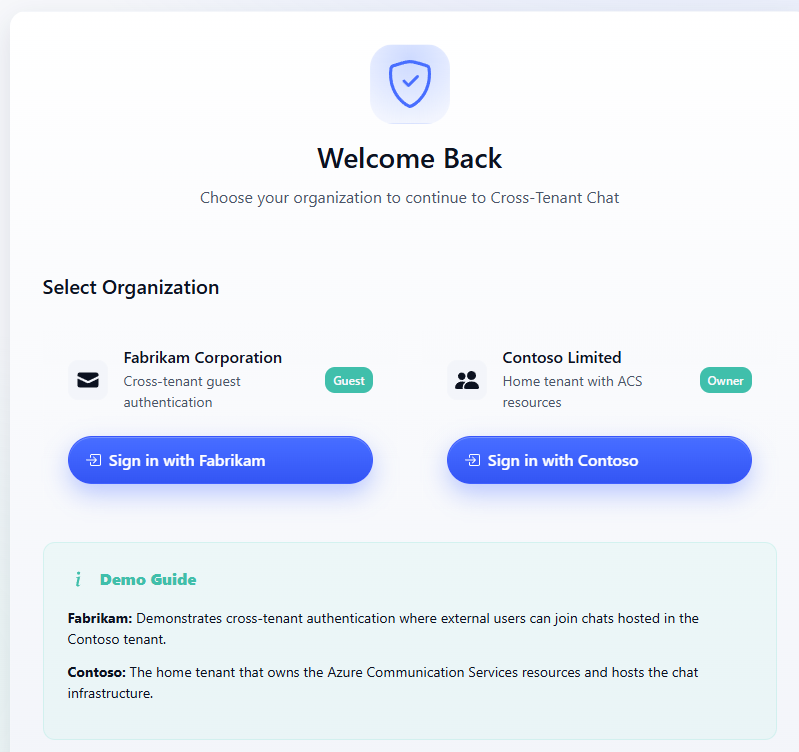
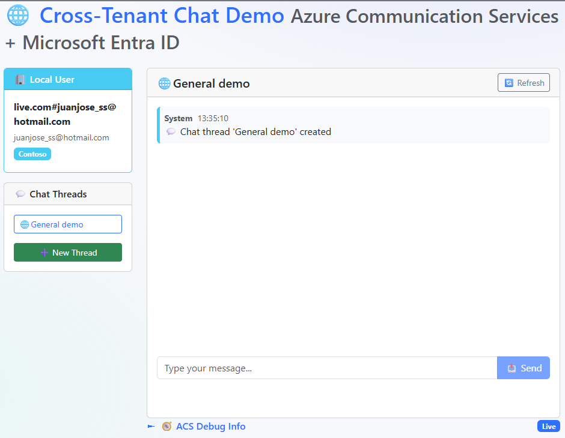
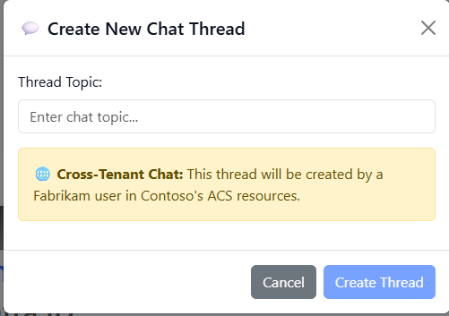

# Cross-Tenant Chat (ACS + Microsoft Entra ID) — Deep Dive

This repository demonstrates a cross-tenant chat experience using Azure Communication Services (ACS) with Microsoft Entra ID. A user from one tenant (Fabrikam) can authenticate and chat in ACS resources hosted by another tenant (Contoso). The app is built with ASP.NET Core Blazor Server (.NET 9).

This document provides a full tour: architecture, flows, configuration, deployment, security, troubleshooting, and extension ideas. For a minimal “just run it” guide, see `README.md`.

Image note
- Place screenshots under `docs/images/` with the names used below. If you’re viewing this on GitHub and images don’t render, verify the files exist in that folder.

## Visual Walkthrough

1) Welcome / Org selection



2) Main chat UI (selected thread, messages, composer)



3) Create thread modal (cross-tenant hint)



## 1) Architecture at a Glance

```
Browser (Blazor Server UI)
   │
   ▼
ASP.NET Core (CrossTenantChat)
   ├─ Services/
   │   ├─ EntraIdAuthenticationService.cs        (demo auth)
   │   ├─ LiveEntraIdAuthenticationService.cs    (live auth)
   │   ├─ AzureCommunicationService.cs           (demo ACS)
   │   └─ LiveAzureCommunicationService.cs       (live ACS)
   ├─ Components/Pages/Chat.razor                (chat UI)
   └─ Configuration/AzureConfiguration.cs

Tenants
 ┌─────────────────────────────────────────────┐  ┌─────────────────────────────────────────────┐
 │    Fabrikam (Identity Source)               │  │      Contoso (ACS Host)                     │
 │    • Microsoft Entra ID (Workforce ID)      │  │      • Azure Communication Services (Chat)  │
 │    • App Registration (optional, live)      │  │      • App Registration / Token exchange    │
 └─────────────────────────────────────────────┘  └─────────────────────────────────────────────┘
```

Key ideas
- Two modes: Demo (no Azure needed) and Live (real ACS + Entra ID).
- The Live path exchanges an Entra ID token for an ACS access token used to call the Chat SDK.
- UI highlights cross-tenant context with clear visual badges and icons.

## 2) Operating Modes

- Demo mode
  - No Azure resources required.
  - Simulated auth and ACS interactions via `AzureCommunicationService` and `EntraIdAuthenticationService`.
  - Useful to explore flows and UI quickly.

- Live mode
  - Uses `LiveEntraIdAuthenticationService` and `LiveAzureCommunicationService`.
  - Real tenants, app registrations, and ACS resource.
  - Configure via `appsettings.Live.json` (or environment variables/Key Vault) and run with `ASPNETCORE_ENVIRONMENT=Live`.

## 3) Authentication and Token Exchange Flow

High level (Live mode):
1. User authenticates with Microsoft Entra ID.
2. The app identifies tenant/claims and determines cross-tenant context.
3. The server exchanges the Entra ID token for an ACS access token (scopes include ACS Chat).
4. The app uses the ACS token to interact with the ACS Chat service for threads/messages.

Implementation notes
- Claims mapping occurs in `Components/Pages/Chat.razor` (see `InitializeAuthenticatedUser`).
- Fabrikam tenant detection uses a known tenant ID constant for demo purposes.
- In Live mode, token exchange and ACS operations are in `Live*Service` classes.

## 4) Data Model (simplified)

- `ChatUser`
  - `Id`, `Name`, `Email`, `TenantId`, `TenantName`, `IsFromFabrikam`, `AccessToken`, `TokenExpiry`.
- `ChatThread`
  - `Id`, `Topic`, `IsCrossTenant`, `Participants`.
- `ChatMessage`
  - `Id`, `SenderId`, `SenderName`, `SenderTenant`, `Type` (Text, System, CrossTenantInfo), `Timestamp`, `Content`.

## 5) UI Behaviors and UX Details

- Thread selection
  - User explicitly selects a thread; no default thread is auto-created.
  - “New Thread” modal prompts when there are no threads.

- Enter to send
  - The message input is wrapped in a form; pressing Enter submits and sends.
  - The send button is also available.

- Auto-refresh
  - Periodically refreshes both the thread list and the messages for the selected thread.
  - Settings are configurable (see Configuration).

- Message rendering and sanitization
  - The UI conditionally shows a globe icon (🌐) for Fabrikam senders.
  - A sanitizer removes any legacy leading globe characters from persisted content to prevent duplication.

- Visual cues
  - Tenant badges and background accents help distinguish cross-tenant messages.
  - `AcsDebugPanel` provides inline diagnostics (collapsed by default).

## 6) Configuration

Files
- `appsettings.json` — base defaults (safe-to-commit placeholders)
- `appsettings.Live.json` — overrides for Live (should not contain secrets in a real project)
- Environment variables — recommended for secrets
- Azure Key Vault — supported in Live scenario (see `Azure:KeyVault` settings)

Important keys
- `Chat:AutoRefreshEnabled` (bool, default true)
- `Chat:AutoRefreshIntervalMs` (int, 500–10000; default ~1500)
- `Azure:AzureAd:*` — Entra ID application details, tenant IDs, and scopes
- `Azure:AzureCommunicationServices:*` — ACS connection/endpoint/resource settings
- `Azure:KeyVault:*` — Key Vault URI and credential preferences

Sample (redacted)
```json
{
  "Azure": {
    "AzureAd": {
      "Instance": "https://login.microsoftonline.com/",
      "ClientId": "<contoso-app-client-id>",
      "ClientSecret": "<secret-from-key-vault-or-env>",
      "TenantId": "<contoso-tenant-id>",
      "FabrikamTenantId": "<fabrikam-tenant-id>",
      "ContosoTenantId": "<contoso-tenant-id>",
      "Scopes": [
        "https://communication.azure.com/.default",
        "https://graph.microsoft.com/User.Read"
      ]
    },
    "AzureCommunicationServices": {
      "ConnectionString": "<acs-connection-string-or-msi>",
      "EndpointUrl": "https://<acs>.communication.azure.com",
      "ResourceId": "/subscriptions/<sub>/resourceGroups/<rg>/providers/Microsoft.Communication/communicationServices/<name>"
    },
    "KeyVault": {
      "VaultUri": "https://<vault>.vault.azure.net/",
      "Enabled": true
    }
  },
  "Chat": {
    "AutoRefreshEnabled": true,
    "AutoRefreshIntervalMs": 1500
  }
}
```

Secrets guidance
- Do not commit real secrets to source control.
- Prefer Azure Key Vault, environment variables, or user-secrets for local development.

## 7) Running Locally

Demo mode (no Azure):
```powershell
# From repo root
Dotnet restore
Dotnet run
```
Open the app and navigate to `/chat`.

Live mode (with real Azure):
```powershell
# From repo root
$env:ASPNETCORE_ENVIRONMENT = "Live"
Dotnet run --project CrossTenantChat.csproj --no-launch-profile
```

## 8) Deploying and Wiring Up Azure (Live)

Quick path with scripts (see `Infrastructure/`):
```powershell
# 1) Provision Azure resources (ACS, etc.)
cd Infrastructure
./deploy-azure-resources.ps1

# 2) Create/Configure app registrations and cross-tenant settings
./setup-app-registrations.ps1 -ContosoTenantId "<contoso-tenant-guid>" -FabrikamTenantId "<fabrikam-tenant-guid>"

# 3) Generate config (optional helper)
./generate-config.ps1

# 4) Back to app root and run Live
cd ..
$env:ASPNETCORE_ENVIRONMENT = "Live"
Dotnet run --project CrossTenantChat.csproj --no-launch-profile
```
Manual/reference docs
- `LIVE_DEPLOYMENT_GUIDE.md` — expanded live setup
- `Infrastructure/MANUAL_SETUP_GUIDE.md` — manual end-to-end
- `Infrastructure/HEALTH_CHECK_README.md` — health checks and validation

## 9) Key Files (Quick Tour)

- `Components/Pages/Chat.razor` — main UI and behaviors
  - Auth initialization, thread & message retrieval, form-submit send, auto-refresh loop
- `Services/*` — demo vs live implementations for auth/ACS
- `Configuration/AzureConfiguration.cs` — binding & helpers for Azure config
- `Infrastructure/*` — deployment and registration scripts; tenant configuration examples
- `appsettings*.json` — configuration files (do not store real secrets in Git)

## 10) Security Hardening Checklist

- Authentication and authorization
  - Validate issuer/audience; use well-known metadata endpoints
  - Restrict allowed tenants; enforce explicit allowlists
- Secrets
  - Store secrets only in Key Vault / environment variables
  - Use managed identity where possible; avoid connection strings
- ACS access
  - Scope tokens minimally; rotate keys regularly
  - Enforce server-side authorization on thread/message operations
- Ops
  - Centralized structured logging; monitor failures and anomalies
  - Turn off demo conveniences in production

## 11) Troubleshooting

- Windows build file lock
  - If `CrossTenantChat.exe` is locked during build, stop the process (Task Manager or `Stop-Process`) and rebuild.
- Live config not applied
  - Ensure `ASPNETCORE_ENVIRONMENT=Live` is set in the same shell session that runs `dotnet`.
- Auto-refresh too frequent/slow
  - Tweak `Chat:AutoRefreshIntervalMs` (500–10000 ms).
- Login issues
  - Check tenant IDs, app IDs, and redirect URIs in app registrations.
  - Verify scopes and admin consent.
- Network/proxy
  - Ensure websockets/long polling aren’t blocked in your environment.

## 12) Extending the Demo

- Persistence layer for threads/messages (DB, Cosmos DB)
- Participant management UI (invites, roles)
- Typing indicators and read receipts
- Notifications (Azure Event Grid / SignalR) to reduce polling
- Power BI/Log Analytics dashboards for audit/usage
- Admin tools (thread ownership, tenant policy rules)

## 13) Recent Improvements in This Repo

- Enter-to-send: input wrapped in a form; submit sends the message
- Auto-refresh: now refreshes both threads and messages each tick
- Sanitization: deduplicates legacy globe icon prefixes in message content

## 14) License and Credits

This is a demonstration project intended for learning and prototyping. Follow your organization’s security and compliance requirements for any production use.

References
- Azure Communication Services: https://learn.microsoft.com/azure/communication-services/
- Entra ID + ACS quickstart (.NET): https://learn.microsoft.com/azure/communication-services/quickstarts/identity/microsoft-entra-id-authentication-integration?pivots=programming-language-csharp